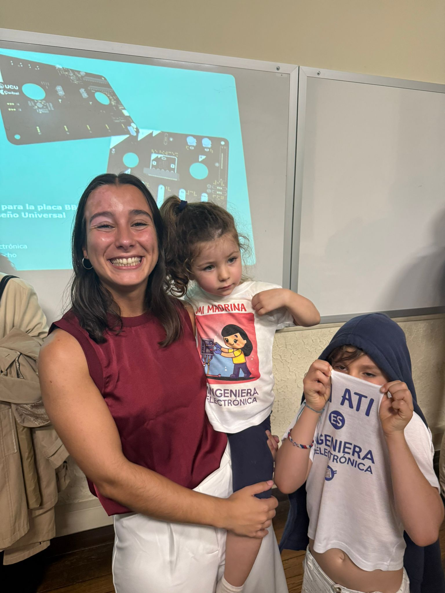
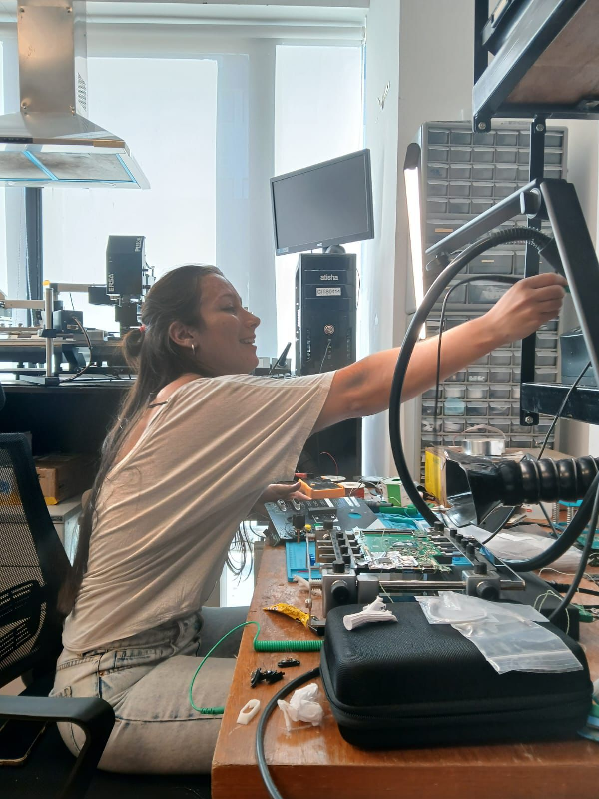
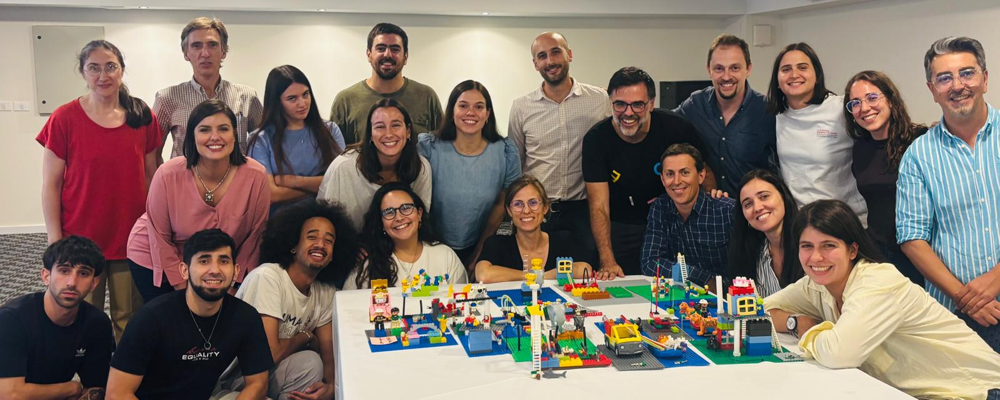
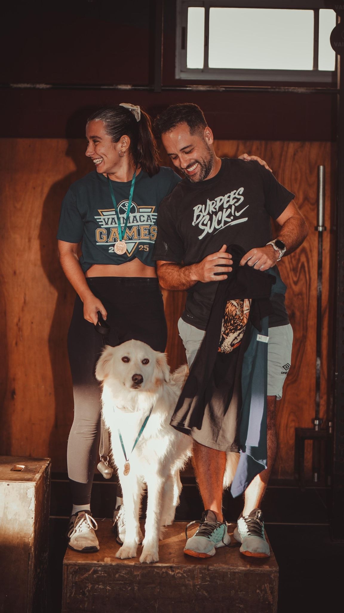

# Esta soy yo... Jose

Podría enlistar mis estudios y trabajos y logros, pero eso me parece que se queda corto para decir quien soy.

Según mi Linkedin:

"Ingeniera en Electrónica | Investigadora I+D+i @Ceibal | Stanford University Innovation Fellow." Y para rematarla "Me apasiona aprender, progresar, mejorar. Creo que la organización y planificación es la clave para el éxito, estar abiertos al cambio, a redireccionarnos, sin dejar de tener un objetivo adelante. Me encanta la sinergia de la tecnología y lo social, en su justa medida, es la receta perfecta."

Según mi Instagram:

"Tengo pestañitas blancas 🤍
Cuando uso moña me convierto en atleta 🎀 🏋🏽‍♀️
Sino soy ingeniera y tía de 3 🩷🩵💜"

Y si, me recibí de ingeniera electróncia en Abril, mirenme con mis 2 sobrinos, la sonrisa no entraba en la cara!

*Con mis sobrinos el día de mi recibimiento después de la defensa de Tesis, abril 2025*

De manera innata me encanta inventar cosas desde que tengo memoria. Pelee de manera inalcanzable para hacer una tesis que pudiera después ser escalada y asi lo hice. Me hago mis almohadones, tuve epocas donde me hacía ropa, y me cuesta apagar mi cabeza de las ideas de cosas que deberían existir. No soy nada buena soldando, pero también es parte de mi.

*Soldando un dispositivo electrónico de diseño propio.*

Por suerte encontre hace casi 3 años un trabajo que me permite crear. Formo parte del departamento de Investigacion, Desarrollo e Innovación de Ceibal (O como le decimos nosotros "imasdemasi"), y ahi lidero tooodos los proyectos de accesibilidad, teniendo espacio para proponer lo que se me venga a la mente. Y teniendome que hacer cargo después... Miren que lindo equipo tengo :) Si, a veces jugamos con Legos.

*Mi equipo de trabajo de Ceibal.*

Pero asi como tengo una mente inquiera, mi cuerpo no es distinto. Hago deporte desde que tengo memoria, y desde los 16 me meti en el mundo del CrossFit. Ah no dije, tengo 25. Y muchas cosas se dicen del CrossFit, y las modas que lo elevan y lo destruyen, pero para mi el deporte es mi segunda casa. El Box (donde entrenamos) es donde paso 3 horas por día, aprendiendo que los resultados son prueba de lo que hago, que lo que me propongo lo logro, que vale la pena el sacrificio para tener satisfacción después. Y obvio, la competencia también es parte de mi. El deporte es un maestro de vida. Estos somos Fabi, Jazmín y yo, terminando felices una competencia.

*Fabian, Jazmín y yo en la premiación de una competencia de CrossFit*

Jazmín, un personaje nada menor en mi vida. Mi hija perruna. Ella tiene un rol muy importante en este pequeño pedacito de internet que me pertenece, va a ayudarme a explicar lo que a veces se hace aburrido, de una manera mas divertida. No se olviden de esto.

Si quiero resumirlo, soy una persona con mucho frentes, como un cubo, cada lado de diferente color. Pero de aristas suaves, que conectan cada lado con mucha facilidad. Loca por el deporte, la teconología, la gestión eficiente, el diseño de cosas nuevas, ferviente abanderada de la accesibilidad, sensible hasta por los poros, y comunicadora por naturaleza. Lo de la accesibilidad voy a dejar que aparezca solo con el tiempo... no va a demorar.

Adéuuuuu,
Jose.

