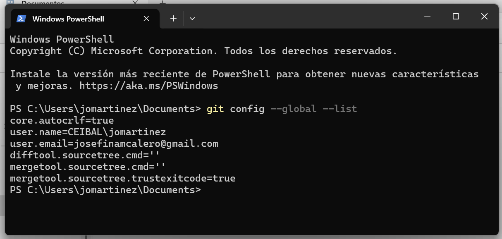
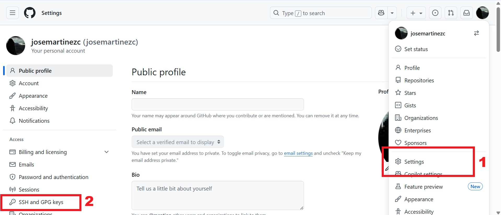
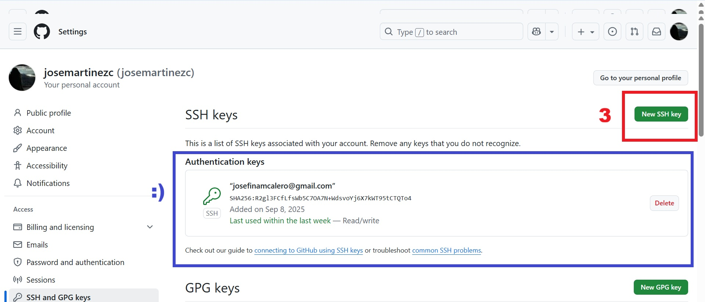
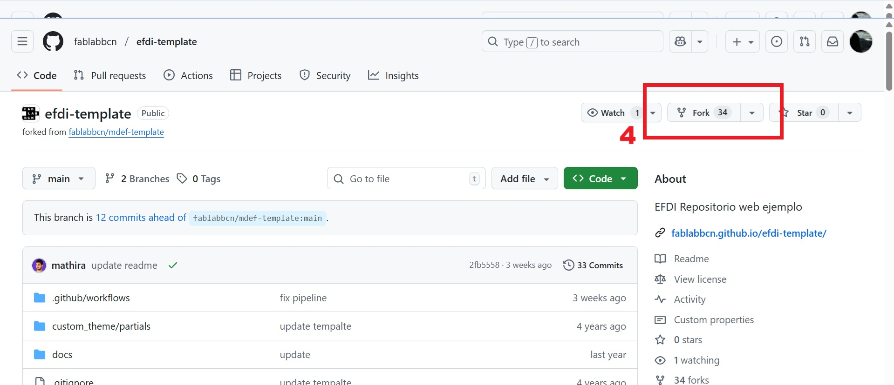
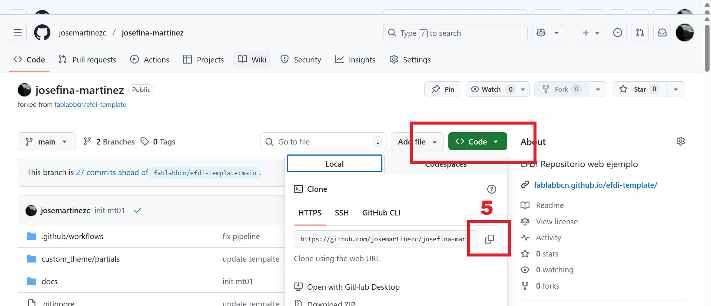

---
hide:
    - toc
---

# MT01

## Creando mi propio repositorio

Hace años que quiero tener un portfolio digital, un lugar donde guardar mis ideas y proyectos. Asi que este módulo, me vino ~al pelo. 

Terminado el MTO1, este pedacito de internet (el repositorio), es solamente un repositorio hecho con un template. Mi objetivo: converitrlo con el tiempo en un espacio que me identifique y describa, mas parecido, a un portfolio. 

### Paso 1: Crear mi usuario de GitHub, o mejor dicho, revivirlo. 

<div style="display: flex; align-items: center;">
  <div style="flex: 3;">
    <p>
      Desde que trabajo en Ceibal uso BitBucket, asi que el objetivo acá, fue revivir mi GitHub, que algún dia por algun motivo me lo abrí, y jamás lo use. Pero si, obvio que no me acordaba de la contraseña.
    <p>
    Reseteamos contraseña y... acá ta!
    </p>
  </div>
  <div style="flex: 1; text-align: right;">
    
  </div>
</div>

[Mi repo de GitHub](https://github.com/josemartinezc)


### Paso 2.1: Enlazarlo a mi PC, con un repo local.

Esto me llevó mas tiempo... nunca había usado una SSH key. Acá el paso a paso que hice para poder generarla y enlazar mi GitHub de manera mas segura.

Para hacer este paso fue necesario tener descargado en la PC Git Bash. En caso de no tenerlo descargado previamente en otra PC, se descarga de internet.

Mediante el comando 

```bash
git config user.email "mi correo"
git config user.name "mi nombre de usuario"
```
en la ventana de comandos enlace mi usuario de GitHub. Verificandolo luego.



### Paso 2.2: Generar la SSH Key

Este paso es clave para que la conexión entre los repositorios remotos de GitHub y los locales de mi PC se hagan se manera segura. UPS! Hasta ahora había sido insegura. 

Primero generé la contraseña (key) local. Y después la vizualisé para copiarla, porque la iba a necesitar después.

```bash
ssh-keygen -t rsa-C "mi correo"
cat ~/.ssh/id_rsa.pub
```
Con el texto que aparecía, una mezcla muy larga de letras y numeros, me fuí al navegador, entré a GitHub y me dirigí a Configuración (Paso 1) y después SSH and GPG keys (Paso 2).



En esa ventana se debe selecciónar "New SSH key" (Paso 3) y una vez hecho tiene que figurar una ventana como la remaracada en azul. Eso es señal de que quedó bien :)



### Paso 3: Generar mi repositorio

Le voy a llamar a esta página de GitHub, por ahora mi lugar de documentación de la especialización en Fabricación Digital e Innovación: <span style="color:#e5446d"><i>Mi Pedacito de Internet</i></span>. Lo creé a partir de un template guardado en otro repositorio de FabLab Barcelona, generado con el proposito de cumplir la función de espacio para documentación. 

[Repositorio del Template de EFDI](https://github.com/fablabbcn/efdi-template)

Para esto se debe hacer un "Fork" (Paso 4) que es como generar una copia del repositorio completo, y tener mi propio repositorio.



Una vez generado el Fork, queda guardada una copia en mi repositorio remoto, en otras palabras, en mi GitHub. Para poder editar esto, de una manera sencilla, en un editor de texto amigable, y trabajar en mi propia PC, es que hacemos el ultimo paso, de generar un repositorio local.

*Repositorio local: una carpeta en mi compu (basicamente).*

La magia es que no es solo una carpeta en mi compu, sino que es un archivo de git, con todo el historial de cambios, conectado a un repositorio remoto, al que cualquier puede acceder.

Para hacer todo ese biru biru, que suena mas complejo de lo que realmente termina siendo, tuve que generar un "Clone" (Paso 5) en un lugar de mi PC. 



Copiar ese enlace, y luego en una ventana de comandos abierta donde quiera guardar el repositorio local ejecutar:

```bash
git clone <ctrl v>
```
### Paso 4: Generar Mi Pedacito de Internet

Ahora si, en Visual Studio, abrimos el repositorio en el WorkSpace. Visual Studio es un editor de código, que facilita la experiencia de hacer código y sincronizar con el repositorio remoto desde el local. 

*El uso de este editor es familiar para mi desde antes*

Cada vez que hago un "push" de mi código nuevo esto genera una actualización en <span style="color:#e5446d"><i>Mi Pedacito de Internet</i></span>. 

Y aca tenemos... el lugar donde estoy pudiendo leer esto. Una matrix en si misma. 

*Toda la edición de colores, tipografía, añadido de imágenes, la hice con asistencia de CoPilot de Visual Studio y ChatGPT.* 


